# 软件构造（重点考察第三章）

## 第一章

###1.1 软件构造的多维度视图（Multi-dimensional software views）


#### Build-time, moment, code-level

代码如何在逻辑上被组织为基本的程序块，例如函数、类、方法、接口等，以及其之间的依赖关系。

#### Build-time, period, code-level

代码在时间尺度上的变化，例如代码行的增删改。

#### Build-time, moment, component-level

源代码被组织为文件，文件被组织进目录；文件被包含在包中，在逻辑上也被包含在容器和子系统中；可复用的模块被组织为库。

#### Build-time, period, component-level

软件系统中的文件、包、容器、库随时间如何变化，或称版本如何变化。

#### Run-time, moment, code-level

快照图(snapshot diagram)、内存转储(memory dump)。即软件在运行时保有的数据及其在内存中的结构。

#### Run-time, period. code-level

顺序图(sequence diagram)、运行时栈跟踪(execution stack trace)

#### Run-time, moment, component-level

部署图（各个组件被部署在了哪些机器上）。

#### Run-time, period, component-level

事件日志

### 1.2

不需要记“可维护性”等概念内容，只需知道哪些质量属性是外部的（用户能感受到的），哪些是内部的。

## 第二章（重点考察什么是版本控制工具）

### 2.1 软件开发过程

#### 传统软件开发过程

##### 瀑布模型(Waterfall)（顺序，不可迭代）

**描述**：按阶段实现软件，基本分为需求-设计-实现-验证-维护。

**特点**：容易使用，但实现后更改需求代价较大。

##### 增量模型(Incremental)（不可迭代）

**描述**：软件被逐次一点点地设计、实现和测试，直至完成。相当于瀑布模型的反复增量完成。

**特点**：系统被分为许多子项目；高优先级的需求被首先完成；当一部分完成后，该部分的需求将被冻结。

##### V模型(V model)（为了测试）

**描述**：可看做是瀑布模型的扩展。阶段为：需求分析-概要设计-详细设计-软件编码-单元测试-集成测试-系统测试。

**特点**：适用于易被模块化的传统软件开发，开发和测试同时进行。

##### 原型模型(Prototyping)（可迭代）

**描述**：产品原型仅模拟了最终产品的一部分，且可能完全不同。阶段为：确定基本需求-实现原型-复审-改进原型。

**特点**：软件设计者和开发者可从用户处得到反馈；客户可在软件开发过程中及时评价软件是否满足需求；总工程师可通过原型设计过程摸清软件架构，以及推算deadline可否满足。

##### 螺旋模型(Spiral)（可迭代）

**描述**：螺旋模型是一个风险驱动模型，通过分析项目当前面临的风险来选择适当的开发模型（如瀑布模型等）。

**特点**：引入风险分析，使软件开发面临巨大风险时有机会停止；在每个迭代阶段构建原型以减小风险；适合大型昂贵系统开发。

#####例题

> 考虑到以往学生无法掌握到教师的日程安排，经常出现教师和学生的空闲时间相冲突而无法进行有效的面对面沟通的问题。学校发布了手机网上预约系统的招标公告。通过此系统学生可以向教师提出预约申请，以便教师安排其日程计划，供学生和教师进行更加便利的面对面交流。
>
> 你所带领的小组在看到此招标公告后，经过初步的研讨，决定参与此项目的竞标，通过几轮的淘汰和筛选，你所带领的小组获得此项目的开发权。
>
> 目前项目开发中存在以下实际情况：
>
> 1. 你所带领的小组不是很熟悉手机系统的编程，并且对B/S和C/S结构的区别仅仅停留在书本上，缺少实际的开发经验。
> 2. 项目时间非常紧迫，考虑到教师和学生都需要此项目提供的功能，因此校方希望能够尽早的看到此项目的早期版本。
> 3. 校方提出了很多扩展要求，但是没有被包含到需求陈述中，因此后期可能会针对系统做出大量的调整和更改。
>
> **根据你所学到的软件过程知识，请从“瀑布模型”、“原型模型”、“增量模型”三种模型中选择最适合此项目开发的过程模型，并简述选择原因。**

#####答题要求

答出使用何种开发过程完成，说出原因（优缺点仅需理解不需背诵）。

#### 敏捷开发过程

##### 常见模式

- 结对编程
- 测试驱动开发

#####与传统开发过程的区别

- **独立开发和交流**代替**采用进度和工具**
- **为客户展示软件的运行**代替**给客户提供文档让其理解**
- **客户直接合作**代替**谈论和修改合同**
- **通过软件/客户的反应进行修改**代替**根据计划进行工作**

#### 版本控制系统(VCS)

##### 专有名词

- **仓库(repository)**：用于存放项目的各个版本的，位于本地或远程的存储空间。
- **工作副本(working copy)**：项目位于本地的，可编辑的副本，开发者可以在其上进行工作。
- **文件(file)**：项目中的一个文件。
- **版本(version/revision)**：项目的内容在某一时间点的记录。
- **更改(change/diff)**：两个版本之间的差异。
- **头(head)**：当前版本。

#####操作

- 回到过去的版本
- 比较两个不同的版本
- 将完整的版本历史推送到另一个位置
- 将版本历史从另一个位置取来
- 合并从同一早期版本生出的不同分支
- 交流/共享/合并不同开发者的工作
- 记录不同开发者的工作日志

##### 类型

- 本地版本控制系统(local VCS)
- 中心化版本控制系统(centralized VCS)
- 分布式版本控制系统(istributed VCS)

##### 特点

- 允许合并两个从同一早起版本分支而来的版本。
- 允许查看版本历史，包括每个版本的编辑者等信息。
- 允许平行工作，即允许多个编程者中的任何一个在保持版本控制的同时能做自己的工作。
- 允许依进度工作，即允许多个编程者在保持版本控制及不打扰他人的前提下共享未完成的工作。

#### Git简介

##### 各个工作区域

- **工作区(workspace)**：可直接编辑，相当于**工作副本**。
- **暂存区(staging)**：记录工作区中被修改过且修改被添加到暂存区的文件。
- **本地仓库**：即位于本地的版本**仓库**。
- **远程仓库**：即位于远程的版本**仓库**。

##### 常用Git命令（不包括分支相关命令）


##### Git版本存储原理

Git将每个文件的每个版本作为一个副本进行保存，允许多个commit共享一个文件副本（进而节省存储新版本的空间）。因此，Git中每个版本均以副本形式存储，创建分支的速度与版本历史复杂程度无关。

相比之下，传统版本控制工具通过存储版本之间的改变以存储版本，创建分支的速度与版本历史复杂程度有关。

##### 例题

> 有三个开发者参与一个项目，A 负责开发初始代码，B 负责修复bug 和优化代码，C 负责测试并报告bug。项目的Git 服务器为S，三人的本地Git 仓库已经配置好远程服务器（名字均为origin）。项目的Git 版本状态如图所示，三人的本地Git 仓库的状态也是如此，其中包含主分支master，当前工作分支是master。
>
> 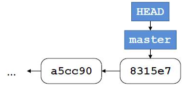
>
> 此时他们三人开展了以下工作：
>
> 1. A 开发了某项新功能，他创建了分支b1 并在该分支上提交新代码，推送至服务器S；
> 2. C 获取了A 的提交，并在其上开辟了新分支b2，在b2 上撰写测试程序并提交和推送至服务器S；
> 3. C 在执行测试程序过程中发现了A 的代码存在问题，C 将bug 信息报告给B；
> 4. B 获取了C 推送的包含测试程序的版本，在其基础上开辟了一个新分支b3 用于bug 修复，当B 确认修改后的代码可通过所有测试用例之后，向Git 做了一次提交，将b3 合并到b2 上并推送至服务器S；
> 5. C 获取B 的修复代码并重新执行其中包含的测试程序，确认bug 已被修复，故将其合并到主分支master上，推送至服务器S，对外发布。
>
> **题目：**
> **(1) 在图上补全上述活动结束后服务器S 上的版本状态图（需注明各分支的名字与位置）；**
> **(2) 写出B 为完成步骤d 所需的全部Git 指令，指令需包含完整的参数。**

题型即**给定一系列Git命令，能绘制版本图；或给定版本图，写出Git命令**。

### 2.2 软件构造过程中的工具（基本不涉及或一道小题）

**不考查如何build。**

#### Maven常见命令

- **validate**：验证项目正确，所有必要信息均完好。
- **compile**：编译项目源代码。
- **test**：使用一种单元测试框架以测试源代码。
- **package**：将已编译代码打包为可发布格式，例如jar。
- **verify**：运行并检查集成测试的结果以保证质量合格。
- **install**：向本地仓库中安装指定的包以作为其它本地项目的依赖。
- **deploy**：在构建环境中完成，将最终包拷贝至远程仓库以分享给其它开发者和项目。

**小题**：如何使用Maven等工具撰写脚本。

## 第三章（五个节都考）

### 3.1 数据类型及类型检查

#### 基本类型与引用类型

**根类**：所有引用类型均为**Object**的子类。

**包装类型**：基本类型不可变的容器。

| int     | long | byte | short | char      | float | double | boolean |
| ------- | ---- | ---- | ----- | --------- | ----- | ------ | ------- |
| Integer | Long | Byte | Short | Character | Float | Double | Boolean |

| 基本类型                                             | 引用类型                                        |
| ---------------------------------------------------- | ----------------------------------------------- |
| int, long, byte, short, char, float, double, boolean | classes, interfaces, arrays, enums, annotations |
| 基本类型的包装类均为不可变(immutable)类              | 一些是可变(mutable)类，一些是不可变类           |
| 在方法中声明的储存在栈中，其余在堆中                 | 均在堆中，由垃圾回收器回收                      |
| 开销小                                               | 开销大                                          |

#### 类型检查

#####检查时机

- **静态检查**：在程序运行之前进行类型检查。对于静态类型语言（如Java），所有变量的类型在编译时均已知，因此编译器可以在编译时检查类型。
- **动态检查**：在程序运行过程中进行类型检查，对于动态类型语言（如Python），变量的类型在代码编写中不一定可知。
- **无检查**：不进行类型检查，依靠程序员的自觉。可能导致程序错误。

##### 类型转换

除具有祖先关系的类之外，一般两个类型间无法直接转换。

```java
String five = 5;         // ERROR
```

数字类型支持由下至上（由低精度到高精度）自动转换，而由上至下（由高精度到低精度）只能手动转换。

```java
int a = 2;               // a = 2
double a = 2;            // a = 2.0
int a = 18.7;            // ERROR
int a = (int)18.7;       // a = 18
double a = 2/3;          // a = 0.0
double a = (double)2/3;  // a = 0.6666...
```

####可变(mutable)与不可变(immutable)

**可变(mutable)**：类的实例中的引用或基本类型变量值可以被改变。（不安全）

**不可变(immutable)**：类的实例中的引用或基本类型变量值不可被改变，使用**final**实现。（安全）

注意final仅禁止该引用/该基本类型变量的值被改变，而并不禁止该引用所指向对象的内部的改变。

##### 防御式拷贝(defensively copy)

动机：可变类型对象的引用在被传递中可能暴露给其它对象，从而被意外地改变，影响程序正确性。

方法：当对象需要暴露给外界时，使用其构造方法等手段将其拷贝，确保外界无法获取该对象及其内部各对象的引用。

####snapshot diagram

**描述**：一个程序在运行时某一时刻的内部状态，包括栈和堆。

##### 画法

- **基本类型变量**：一个箭头指向该变量的值。

  

- **引用类型变量**：一个箭头指向一个椭圆，椭圆内部包含类名。若想显示更多信息，可在椭圆内写入字段名，并添加箭头以确定其值。

  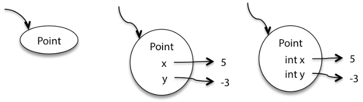

- **可变值**：当变量值变化时，在原来的箭头（值）上打叉并画新的箭头（值）。

  

- **不可变值(final)**：使用双线箭头表示。

  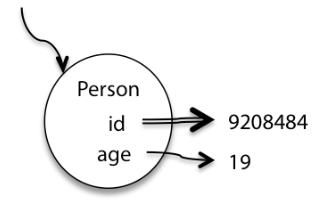

**题型**：给定代码，画出执行之后的snapshot diagram。

##### 例题及解答

```java
public class Main {
    public static void main(String[] args) {
        ArrayList<String> lst = new ArrayList<String>();
        lst.add("a");
        lst.add("b");
        lst.add("c");
        MyIterator iter = new MyIterator(lst);
        // 画出运行至此行时，iter的snapshot diagram
    }
}

class MyIterator {
    private final ArrayList<String> list;
    private int index;
    public MyIterator(ArrayList<String> list) {
        this.list = list;
        this.index = 0;
    }
    public boolean hasNext() {
        return index < list.size();
    }
    public String next() {
        final String element = list.get(index);
        ++index;
        return element;
    }
}
```


#### 空引用(null)

Java中，对于对象的引用变量（例如类的实例变量、数组实例变量等）可被赋值为null，但基本类型不能被赋值为null。注意区分数组实例变量为null与数组实例变量不为null但数组中包含null的情形。例如

```java
String names = new String[] {null}; // names=[null]
names = null;                       // names=null
```

### 3.2 规约(specification)（不考写spec）

####规约的组成

**前置条件(precondition)**：输入满足的条件，在注释中记作**requires**。

**后置条件(postcondition)**：输出满足的条件，在注释中记作**effects**。

**例外行为(exceptional behavior)**：当前置条件不满足时会发生的事件。

#### 规约的意义

规约描述了方法的行为，即当前置条件被满足时，在方法完成后，后置条件一定被满足；当前置条件不被满足时，后置条件**可以**不被满足，或称方法的行为是任意的。

在Java中，可以在方法注释中通过```@param```、```@return```、```@throws```等条目书写规约。

#### 规约的比较

称规约S2比规约S1**等价或更强**当且仅当以下条件同时成立

- S2的前置条件相等或弱于S1的前置条件。
- S2的后置条件相等或强于S1的后置条件。

满足强规约的实现一定满足弱规约。进而，**一个满足弱规约的方法一定可以安全地被替换为满足强规约的方法**。

注意**规约间可能无法比较强弱**。

####注意事项

异常处理和测试策略、并发程序的线程安全性也需要写在spec中。

###3.3 抽象数据型(ADT)

####ADT操作的类型

- **Creators**：接受若干对象以构造新对象，但不包括接受本类型的对象从而构建新对象。参见**Producers**。
- **Producers**：接受一个或几个本类型的对象从而创建新对象。例如String中concat()方法。
- **Observers**：接受本类型对象，返回其他类型对象。例如List的size()方法、Set的contains()方法。
- **Mutators**：改变对象内部值。例如List的add()方法。仅可变(mutable)类具有mutators。

**注意事项**：上述描述中“接受”所指包括调用者。即若使用a.b(c)的形式调用了方法b（其中a为类的实例对象），视为b接受了a和c两对象。

**题型**：给定方法能够分类。

##### 解题策略

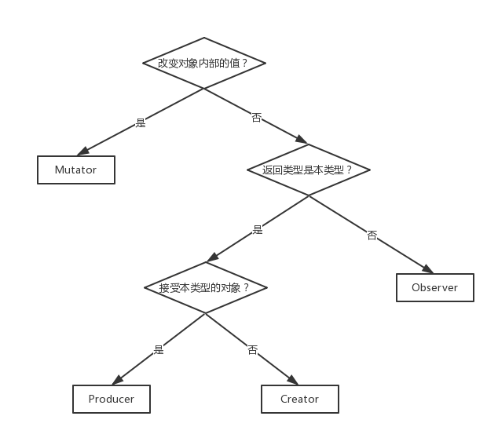

#### 表示独立性(Representation Independence)

**定义**：称一个ADT是表示独立的，意为这个ADT的使用与它的表示（真实数据结构等）无关。表示内部的修改对ADT外部的代码没有影响。不具有表示独立性称为**表示泄露的(representation exposed)**。

**意义**：具有表示独立性的ADT，其使用及正确性仅与其各方法的spec有关，因此可以方便地修改ADT的内部表示以获得更佳的或更适用于新环境的性能。

**获得表示独立性的途径**：最简单的方式为将所有字段的访问控制全部设为private，并对producer和observer加入防御性拷贝。

#### 题型

给定需求，设计ADT（包括representation(rep)、abstraction function(AF)、representation invariants(RI)）

rep：ADT中的真实数据结构。

AF：所存储的数据对应于用户想要的何种内容。即从计算机中的数据到其现实含义的映射。

RI：确定存储的数据是否合法。通过RI可设计checkRep()。RI的本质是从计算机中的数据到布尔值的映射。

### 3.4 面向对象编程

#### 接口、抽象类、具体类

**接口**：一系列方法签名的列表，但不具有方法体，不可实例化。

**抽象类**：具有0或若干个抽象方法（无方法体）的类，不可实例化。

**具体类**：不含抽象方法，所有方法均具有方法体，可实例化的类。

#### 继承/多态

#####继承注意事项

- 声明为final的类不可被继承。
- Java只允许单继承，不允许多继承。

**里氏代换原则(LSP)**：对于类型为T的对象x，令q(x)表示x具有的某一特性，则当S是T的子类型时，类型为S的对象y也应具有特性q(y)。（详见第五章）

**可多态的方法**：父类方法m1和子类方法m2形成多态关系当且仅当m1与m2方法名相同，参数类型（在经过恰当转换和类型擦除后）相同，参数类型顺序相同。注意返回类型可以不同。

**重写(override)**：条件即上述多态方法条件（m1和m2无序）。但一个方法被声明为final时，其不可被重写。

**重载(overload)**：当同一类中的两个方法名称相同而签名不满足重写条件时，则构成重载。

##### 重写与重载的比较

|          | Overloading            | Overriding                     |
| -------- | ---------------------- | ------------------------------ |
| 参数列表 | 必须改变               | 不可改变                       |
| 返回类型 | 可以改变               | 不可改变                       |
| 抛出异常 | 可以改变               | 可以减少，但不得增加或扩大范围 |
| 访问控制 | 可以改变               | 可以放宽，但不得增加限制       |
| 调用选择 | 编译时根据参数列表确定 | 运行时根据对象实际类型确定     |

**题型**：给定代码写出运行结果。

##### 例题及解答

> ```java
> interface Animal {
>     void vocalize();
> }
> class Dog implements Animal {
>     public void vocalize() { System.out.println("Woof!"); }
> }
> class Cow implements Animal {
>     public void vocalize() { moo(); }
>     public void moo() { System.out.println("Moo!"); }
> }
> ```
>
> 根据以上定义，写出下列操作的结果：
>
> ```java
> // 操作1
> Animal a = new Animal();
> a.vocalize();
> // 操作2
> Dog d = new Dog();
> d.vocalize();
> // 操作3
> Animal b = new Cow();
> b.vocalize();
> // 操作4
> b.moo();
> ```

> 操作1：错误，Animal接口不可实例化。
>
> 操作2：输出"Woof!"。
>
> 操作3：输出"Moo!"。
>
> 操作4：错误，Animal不具有moo()方法。

####泛型与协变

**泛型**：使方法或类可以工作在不同的类型下。

**协变**：利用通配符?，提取出泛型中的父子关系，详见**类型转换注意事项**。

##### 类型转换注意事项

- 若B是A的子类，则B[]是A[]的子类。

- 若B是A的子类，泛型T\<A\>与T\<B\>并非父子关系，而泛型A\<T\>与泛型B\<T\>具有父子关系。例如：

  > ArrayList\<String\>**是**List\<String\>的子类型。
  >
  > List\<String\>**不是**List\<Object\>的子类型。

- 泛型T\<? extends A\>不是一个具体类型，而是未定类型，其变量可接受一切类型形如T\<B\>的对象引用，其中B是A的子类。但不论接受何种对象，其都被看做T\<A\>类型对待（进行了协变）。注意**未定类型**和**若干类型的父类**两个概念不同：未定类型尽管未定，但仅能表示若干类型中的**一种**类型；父类则可表示若干类型中的**各个**类型。例如：

  >  List\<String\>**是**List\<? extends Object\>的**一种**（进行了从List\<String\>到List\<Object\>的协变）。
  >
  > List\<? extends A\>**不是**List\<A\>的子类。这是由于List\<? extends A\>尖括号中通配符表示A的**某个子类**。例如尖括号中填入B，此时显然有List\<B\>不是List\<A\>的子类。

上述注意事项之理由参考**里氏代换原则**。

#### 委托

**委托**：一个对象依赖另一个对象或另一个对象的若干方法以完成自身的任务。

##### 委托的形式

| 形式              | 描述                                                         |
| ----------------- | ------------------------------------------------------------ |
| 联系(association) | 对象间永久的关系，使得一个对象可以调用另一对象以完成某行为。 |
| 依赖(dependency)  | 对象间临时的关系，使得一个对象可以要求另一对象提供功能。     |
| 组合(composition) | 组合简单对象以获得复杂对象，通过对象的包含关系实现。主对象被销毁时，子对象同时被销毁。 |
| 聚合(association) | 组合简单对象以获得复杂对象，通过对象的包含关系实现。主对象被销毁时，子对象可能仍存活。 |

### 3.5 对象相等

####==与equals()

**==**：判断对象引用是否相等，即是否指向**同一对象**。

**equals()**：Object类的方法，可被重载，需要满足自反性、传递性、对称性，用于判断两个对象值是否相等（由程序员实现）。若不重载，默认行为与==相同。

####equals()与hashCode()

- 重载equals()方法则必须重载hashCode()方法。要求两个对象equals()返回true时hashCode()必须相等。
- 重载equals()方法时必须重载equals(Object)方法，即参数列表中唯一的参数类型必须为Object。这是由于重载方法的选择调用是在编译时进行的。
- 可变类不应重写equals()和hashCode()方法。

上述重载的原因是HashSet、HashMap等使用散列表形式存储数据，需要计算对象的hashCode。

## 第四章（不考）

## 第五章

### 5.1

#### 框架

##### 白盒框架(whitebox framework)：内部可见

- 扩展性通过继承和动态绑定来实现。
- 已存在的功能通过继承和重写钩子方法(hook method)来扩展。
- 重写钩子方法时通常使用设计模式，如模板方法模式。

##### 黑盒框架(blackbox framework)：内部不可见

- 扩展性通过定义容器接口来实现。
- 已存在的功能通过定义符合特定接口的容器来重用。
- 框架通过委托来集成上述容器。

#### 里氏代换原则(LSP)

**里氏代换原则**：对于类型为T的对象x，令q(x)表示x具有的某一特性，则当S是T的子类型时，类型为S的对象y也应具有特性q(y)。通俗地说，每一个父类对象替换为子类对象后必能实现完全相同的功能。

##### Java编译器对LSP的保证

- 子类可以添加，但不可删除父类的方法。
- 具体类必须实现所有未定义的方法。
- 重写方法的返回类型必须为原方法返回类型或原方法返回类型的子类。
- 重写方法必须接受相同的参数类型。
- 重写方法不能抛出更多的异常，或原方法所抛异常的父异常。

##### LSP的其他要求（编译器无法检查）

- 子类比父类的不变式应当相等或更强。
- 子类的每个方法的后置条件应当比父类的对应方法的后置条件相等或更强。
- 子类的每个方法的前置条件应当比父类的对应方法的前置条件相等或更弱。

#### 以自定义方式排序

##### 实现方式

1. 继承Comparator以实现比较器。
2. 实现Comparable以实现比较器。
3. 使用lambda表达式(a)->boolean以实现比较器。

#### 设计模式

- 适配器模式(adapter)

  系统所需的接口与已有类的接口不一致，但功能相同时，提供接口之间的转换，使得系统能够使用已有类。

  

- 装饰器模式(decorator)

  已知一接口AbstractComponent及其实现类Component，欲为Component添加功能，可创建同样实现接口B的抽象类AbstractDecorator（抽象装饰器），在抽象装饰器中保存一个实现AbstractComponent的实例对象以让抽象装饰器可以实现AbstractComponent要求的所有操作。之后新建继承自抽象装饰器的Decorator（称为装饰器），此时即可在装饰器中添加新方法。

  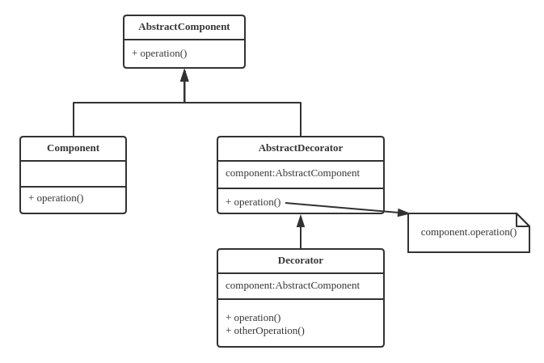

- 外观模式(facade)

  客户端使用子系统中的多个组件易导致混乱时，为组件的所有功能设置一个界面类（图中为Facade类），客户端仅通过界面类提供的方法操作各个组件协同工作。

  

- 策略模式(strategy)

  一个功能（方法）可能以不同的策略实现，希望在运行时灵活切换策略，可将方法实现的策略实现为策略类（图中为若干ConcreteStrategy类），不同策略类实现相同的接口（图中为Strategy接口），但拥有不同的实现。

  

- 模板模式(template)

  一个过程的每个步骤功能是确定的，但某些功能有多种实现方式，以不同的方式实现可获得不同的具体过程。此时将该过程实现为抽象类的一个方法（图中为work()方法），其调用一些抽象方法（图中为若干step()方法），而抽象方法交由具体的子类实现，这样每个具体子类的work()方法就是以某种方式实现的一个具体的过程。

  

- 迭代器模式(iterator/iterable)

  一个用于表示若干对象之集合的类（图中为Aggregate类）对外提供遍历功能时，可建立一个对应的迭代器类（图中为Iterator类）。迭代器提供依序访问该集合中所有对象的功能。

  

- 工厂模式(factory)

  希望通过提供参数灵活控制对象的创建过程（例如提供某参数时建立Product1对象，否则建立Product2对象），可创建一个工厂类（图中为Factory类）以负责创建对象。工厂类提供工厂方法，接受一定的参数，根据参数创建相应的对象并返回。

  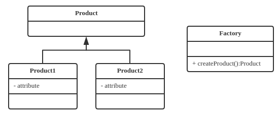

- 抽象工厂模式(abstract factory)

  若干种不同组件（图中为ProductA类和ProductB类）需要搭配在一起使用，因而需要一起生产。每种组件又有若干等级(图中等级表现为数字)，不同种的组件并不能随意搭配，一种某等级的组件只能搭配另一种某特定等级的组件（例如图中A1仅能与B2搭配，A2仅能与B1搭配）。为了实现该种逻辑，将每一种可能的搭配实现为一个工厂（图中为FactoryA1B2类与FactoryA2B1类）。由于每一种组件在不同工厂中生产的结果只是等级不同，而种类相同，因此所有这样的工厂可全部继承自一个抽象工厂（图中为AbstractFactory类）。抽象工厂可提供建造具体工厂的方法，而具体工厂负责生产合法搭配过的产品。

  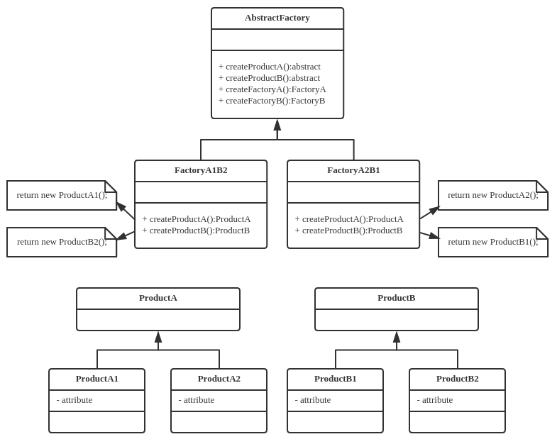

- 构建器模式(builder)

  对象的构建及初始化过程极为繁杂时，可将构建及初始化过程放入单独的构建器类（图中为ProductBuilder类）中，由构建器类负责构建该对象。构建器的声明通常嵌入被构建类（图中为Pruduct类）中，此时可使被构建类的构造方法对外隐藏，仅能由构建器调用。外部创建被构建类对象仅能通过构建器创建。

  

- 桥接模式(bridge)

  一个类中有不止1个方法需要自由切换实现（一般是由于该类有2个以上的互相独立的特性，每个特性都有若干种实现，而特性的所有组合都可能出现），可为每个特性实现一个策略模式，这样便能将各个特性的变化“桥接”起来。

  图例参考**策略模式**。

- 代理模式(proxy)

  希望控制外界对某类对象（图中为Real类对象）的访问，可在外界与该对象之间插入一“中间人”，即代理对象（图中为Proxy类对象），其实现了原对象提供的所有接口。对原对象的请求和原对象的答复由代理对象转发。由此，代理对象通过自定义转发过程即可控制外界对原对象的访问。

  

- 组合模式(composite)

  以树状结构组织对象，即为每个对象提供查询子节点和访问子节点的方法。除此之外，树上每个节点的对象其余可执行的操作相同，树上所有对象没有区别，均为Component的子类型。图中Component可视为节点类型，Leaf为叶类型，Composite为非叶类型。

  

- 观察者模式(observer)

  当某对象（称为被观察者，图中为Worker）的状态改变时，其它一些对象（称为观察者，图中为ConcreteObserver）的状态必须立即随着改变。可为观察者对象实现观察者(图中为Observer)接口，当被观察者变化时，被观察者通过观察者接口通知它的所有观察者进行变化。

  

- 访问者模式(visitor)

  受限于Java的实现机制，当需要根据传入对象所属的类来确定究竟执行哪种操作时，方法重载不能达到目的，只能使用instanceof进行运行时类型判断。为了通过面向对象的方式解决问题，考虑为所有传入对象实现Visitable接口，即为每个对象实现一个accept(Visitor)方法，通过令传入对象反向调用访问者的方式，可以利用Java多态解决这一问题。

  缺点为破坏了类的开闭原则，外部的逻辑侵入了类内部。

  

- 状态模式(state)

  某类对象（图中为Context类对象）在有限种状态（图中为若干StateX类）间切换，在不同状态时调用相同方法可能导致不同的行为，并切换到不同的状态。即对象的行为受当前状态影响，同时也会改变当前状态。

  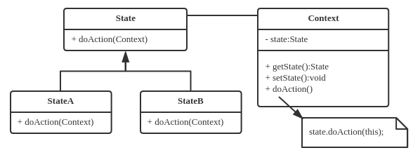

- 备忘录模式(memento)

  希望保存某对象（图中为Originator对象）的历史状态以便之后恢复，可建立若干Memento对象以保存状态，通过Caretaker对象管理多个Memento。

  Caretaker对象仅负责保存Memento对象，但不查看Memento对象内容。

  

- 单例模式(singleton)

  某类（图中为Singleton类）逻辑上仅能存在唯一一个实例，为了防止多个该对象实例被创建，将构造方法设为私有，并提供获取该类唯一实例的方法（图中为getInstance()方法）。

  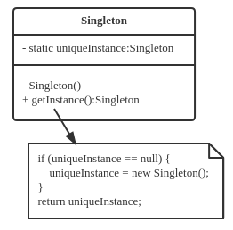

- 原型模式(prototype)

  当需要客户端指定要创建的对象的类型，且之后需创建的对象与先前指定的完全相同时，可通过给出第一个对象（称为原型对象，图中为Prototype的某子类对象）以指明之后所有对象的类型，之后所有对象通过复制第一个对象来创建。

  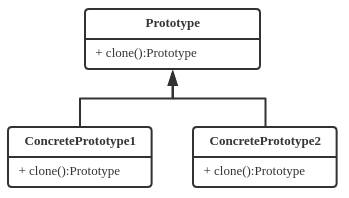

- 享元模式(flyweight)

  当某对象（图中为各个Client对象）由大量对象（图中为实现Flyweight接口的对象）组成，而部分Flyweight对象可被共享（图中可被共享的部分为ConcreteFlyweight类）以减少资源消耗时，可创建一个工厂类以方便外界获得可被共享的对象，对于目前不存在的ConcreteFlyweight对象，工厂类会创建之，而对于已存在的ConcreteFlyweight对象，工厂类会直接返回之。

  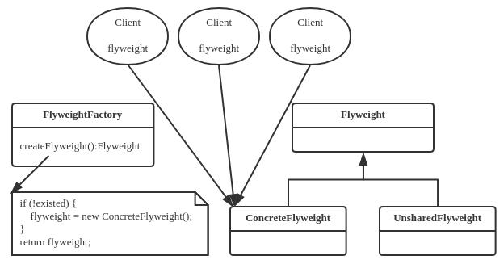

- 对象池模式(pool)

  当某类对象（图中为Object类对象）的创建代价极大，而该类对象可以以较小的代价被重复利用时，可以预先建立一个对象池（图中为Pool类），用于保存该类对象。对象池中可预先创建几个对象等待使用，使用完的对象会回到对象池中被重新初始化并被再利用，减少对象的创建操作。

  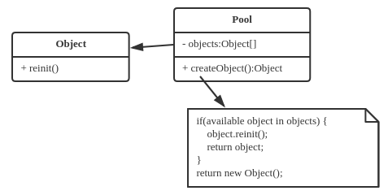

**题型**：写出设计模式思想或画图。

## 第六章

### 可维护性

聚合度与耦合度

SOLID原则：?、接口分离、依赖倒置、开闭原则、?

### 正则表达式

给出具体例子，要求写出正则表达式。

## 第七章

### 异常

异常是什么：Error和Exception（都实现了Throwable接口）。

Error：不是由于程序错误而是由于系统问题引起的（例如JVM故障）。

Exception：Checked和Unchecked异常。

Unchecked异常，是由程序错误引起的，不需要显式地throw和catch。

Checked异常不是由程序错误而是由于外部环境因素出错的，可被捕获和处理。**（由环境因素引起，可预见）**

#### 异常中的LSP

参考第五章**里氏代换原则**。

#### 题型

给定异常代码问对不对

怎样捕获异常

### 断言(assert)

对输入的pre-condition、输出的post-condition等进行判断，方便进行debug。正常运行时应关闭。

### 调试

基本方法：

1. 代码注入
2. 抽样

### 测试

**主要考黑盒测试：**

- 等价类划分：将输入划分为多个等价类，每个等价类内取一个用例进行测试。
- 边界值分析：找出输入的边界值进行测试。

测试策略即测试输入怎样划分，边界值怎样取。

应知道怎样撰写测试策略，以及读测试策略后怎样选择适当的输入。

#### 测试覆盖度

给定输入，写出执行了哪些语句。

## 第八章

### 内存管理

堆和栈的定义。

JVM中堆和栈如何分布。

给定程序，问对象中的数据在堆里还是栈里。

### GC

GC：找出内存中无用的对象，然后清除掉。

给定程序，问哪些是无用对象。

####reachable和unreachable

从root出发，找出root可达的所有对象，即reachable的对象。反之即为unreachable 的对象。

root除了栈还有程序计数器等，应了解root的概念。

GC清理的即unreachable的对象。

#### 四种基本算法

1. reference counting（引用计数）（已弃用，因其无法处理成环引用）
2. mark sweep
3. mark compact
4. copying（分代策略）

### JVM参数配置

需要知道参数意义，即想要调整某个选项时应该调整哪个参数，调整GC模式可用什么参数。

### Java性能调优工具（jstat、jmap、jhat、VisualVM、MAT）

给定工具输出，分析结果。

memory dump：内存在某一时刻的所有数据。

stack trace：程序调用栈。

## 第九章（不考）

进程有独立的内存空间，线程共享同一块内存空间。

## 第十章（线程）

###线程的实现方式

1. 继承Thread
2. 实现Runnable

### 竞争

**定义：**多个线程同时写同一块内存空间，或一个线程读一块内存空间而另一个线程正在写同一块内存空间。

**原因：**时间分片，交错执行。

只有写时会出现竞争：写和读出现竞争或写和写出现竞争。

### 休眠和中断

InterruptionException异常的出现时机：waiting状态被唤醒或被interrupt()。

休眠：sleep()

中断：interrupt()

给定代码，问会不会触发InterruptionException。

1. 局限性（仅能访问局部变量）
2. immutable（让类变成immutable的）
3. 只使用线程安全的数据类型（只能保证某操作是线程安全的原子操作，多个操作之间仍有可能出问题）
4. 同步块/加锁（synchronized）

当锁住ADT中的某个方法时，该ADT的其它所有方法都不再可用？（查阅synchronized原理）

加同步锁能提高程序安全性，但会降低程序效率。

### 死锁(deadlock)

两个线程使用synchronized同时访问两个ADT（A需要B的锁，B需要A的锁）

**解决方案：**

1. 两线程均按顺序征用锁（两个线程均先获得A锁再获得B锁）。
2. 合并两个锁，即将访问两个ADT的锁合并为一个锁。

### 饥饿(starvation)和活锁(livelock)

**饥饿：**某线程由于等待其它资源进入长时间循环。

**活锁：**线程没有锁死，仍在正常运行，但无法正常工作。

例：两线程A、B当一个发送时，另一个必须接收才能正常工作。但A与B在某一时刻开始同时发送同时接收，于是无法正常工作。

####饥饿和活锁的解决方案：

o.wait()：释放o上的锁，使线程进入o的等待队列进入休眠状态。

notify()、notifyAll()：唤醒o的等待队列中的一个/所有休眠线程。

### 考点

消息队列
